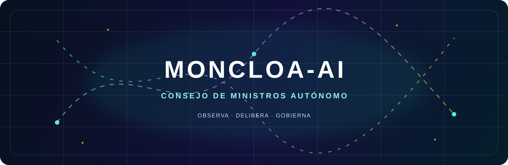
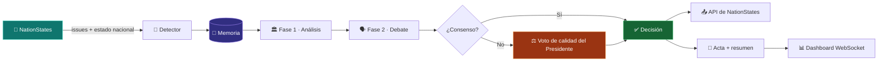

<div align="center">

<a href="https://www.nationstates.net/page=create_nation">
  
</a>

# MONCLOA-AI

### El Gobierno que nunca duerme.

Agente político autónomo para [NationStates](https://www.nationstates.net/): observa los issues de tu nación, convoca un Consejo de Ministros artificial, debate cada opción y ejecuta la decisión con memoria de gobierno.

<p>
  <a href="https://www.nationstates.net/page=create_nation"><strong>🚀 Crea tu nación gratis</strong></a>
  &nbsp;·&nbsp;
  <a href="https://www.nationstates.net/page=login">🔐 Inicia sesión</a>
  &nbsp;·&nbsp;
  <a href="https://github.com/akumanomi1988/Moncloa-AI/issues">💬 Issues</a>
</p>


</div>

<br>

> **¿Qué pasaría si un gabinete de IA gobernase tu nación?**  
> Moncloa-AI convierte cada dilema de NationStates en una deliberación trazable: estrategia, economía, derechos sociales y legalidad sentados en la misma mesa.

## ✨ Lo que hace

| Sistema | Qué ocurre |
|---|---|
| 🏛️ **Consejo multirol** | Presidente, Economía, Sociales y Justicia analizan el mismo issue desde intereses distintos. |
| 🗣️ **Debate en dos fases** | Primera ronda de posiciones, después contraste, negociación y síntesis final. |
| 🧠 **Memoria persistente** | SQLite conserva sesiones, intervenciones, visiones y resultados; Chroma recupera contexto semántico. |
| 🌐 **Conexión con NationStates** | Consulta el estado de la nación y puede enviar decisiones a través de la API del juego. |
| ⚡ **Dashboard en tiempo real** | Panel FastAPI + WebSocket para ver el ciclo de gobierno mientras sucede. |
| 🧪 **Modo simulación** | Prueba decisiones inventadas sin tocar tu nación real. |
| 📜 **Actas y comunicados** | Genera actas del Consejo, resúmenes y comunicados de prensa. |
| 🖥️ **IA local** | Compatible con LM Studio y modelos locales OpenAI-compatible; tus deliberaciones no tienen por qué salir de tu máquina. |

## 🎬 El ciclo de gobierno



## 🧩 Arquitectura

```text
Moncloa-AI/
├── core/
│   ├── agent_core.py            # Prompts, parsing y síntesis de respuestas
│   ├── api_client.py            # Cliente de NationStates
│   ├── deliberation_engine.py   # Orquestación del Consejo
│   ├── memory_store.py          # Sesiones y estado en SQLite
│   └── vector_store.py          # Recuperación semántica con Chroma
├── services/
│   ├── reporter.py              # Actas, resúmenes y comunicados
│   └── vision.py                # Visión estratégica inicial
├── web/
│   ├── app.py                   # FastAPI, páginas, API y lifespan
│   ├── ws_handler.py            # Eventos en tiempo real
│   ├── templates/               # Dashboard, consejo, historial y reglas
│   └── static/                  # CSS y JavaScript del panel
├── config/
│   ├── personalities.yaml       # Ideología, prioridades y líneas rojas
│   └── settings.py              # Configuración desde entorno
├── data/                        # SQLite + Chroma (datos locales)
├── tests/                       # Regresiones del pipeline principal
└── main.py                      # Entrada web o CLI
```

## 🚦 Arranque rápido

### 1. Requisitos

- Python **3.10 o superior**
- Una nación creada en [NationStates](https://www.nationstates.net/page=create_nation)
- [LM Studio](https://lmstudio.ai/) con un modelo de chat cargado y su servidor local activo

### 2. Instalar

```bash
git clone https://github.com/akumanomi1988/Moncloa-AI.git
cd Moncloa-AI

python -m venv .venv
# Windows
.venv\Scripts\activate
# macOS / Linux
# source .venv/bin/activate

pip install -r requirements.txt
cp .env.example .env
```

En Windows PowerShell, si `cp` no está disponible:

```powershell
Copy-Item .env.example .env
```

### 3. Configurar tu nación y tu modelo

Edita `.env` — **no subas nunca este archivo al repositorio**:

```dotenv
NATION_NAME=TuNombreDeNacion
NATION_PASSWORD=TuPassword
CONTACT_EMAIL=tu@email.com

LMSTUDIO_URL=http://localhost:1234
LLM_MODEL=local-model
EMBEDDING_MODEL=all-MiniLM-L6-v2
CHECK_INTERVAL=30
```

### 4. Gobernar

```bash
# Dashboard web en http://localhost:8000
python main.py

# Modo autónomo sin interfaz web
python main.py --cli
```

El primer arranque crea automáticamente `data/`, inicializa SQLite/Chroma y guarda una visión inicial de gobierno. La primera descarga del modelo de embeddings puede tardar.

## 🕹️ Panel de control

| Ruta | Uso |
|---|---|
| `/` | Dashboard con estado de la nación, estadísticas y actividad reciente |
| `/consejo/{id}` | Seguimiento de una deliberación completa |
| `/historial` | Historial de sesiones y decisiones |
| `/historial/{id}` | Acta y comunicado de una sesión |
| `/reglas` | Explicación visual de las reglas del juego |
| `/configurar` | Ajuste de personalidades y configuración del Consejo |
| `/api/status` | Estado operativo del motor |
| `/api/simular` | Ejecuta una deliberación de prueba |

## 🧪 Verificación local

```bash
python -m unittest discover -s tests -v
```

Las pruebas cubren el pipeline de consenso, la lectura del estado nacional desde XML, la interpretación correcta de los identificadores de opción y la generación de resúmenes.

## 🔐 Seguridad y operación

- Las credenciales se leen desde variables de entorno y deben permanecer fuera de Git.
- La IA está planteada para ejecutarse localmente mediante LM Studio.
- `data/` y `logs/` contienen estado operativo; haz copia de seguridad antes de mover o borrar esos directorios.
- En producción, coloca el dashboard detrás de autenticación, HTTPS y una red privada. La aplicación actual expone el panel en `0.0.0.0` para facilitar el arranque local.
- Empieza con `/api/simular` y una nación de prueba antes de activar decisiones automáticas sobre una nación importante.

## 🗺️ Estado del proyecto

**MVP funcional en evolución.** El núcleo de deliberación, persistencia, conexión con NationStates y dashboard están implementados. Antes de un despliegue multiusuario conviene añadir autenticación, gestión de secretos, observabilidad estructurada, límites de concurrencia por nación y una política de licencia pública.

## 🤝 Contribuir

1. Crea un fork.
2. Abre una rama descriptiva: `feat/nueva-capacidad`.
3. Ejecuta la suite de pruebas.
4. Abre un Pull Request explicando el comportamiento y cómo lo verificaste.

Las propuestas que mantengan el desacoplamiento entre motor, almacenamiento, API de NationStates y presentación serán especialmente bienvenidas.

## ⚖️ Nota

Moncloa-AI es un proyecto independiente y no está afiliado oficialmente a NationStates ni a Max Barry. NationStates es un juego de simulación de naciones creado por Max Barry. Consulta siempre las [reglas y FAQ oficiales](https://www.nationstates.net/page=faq) antes de automatizar una nación.

<div align="center">

### ¿Listo para formar gobierno?

<a href="https://www.nationstates.net/page=create_nation"></a>
<a href="https://github.com/akumanomi1988/Moncloa-AI"></a>

<br><br>

<sub>Hecho con 🧠, ☕ y una cantidad constitucional de debates.</sub>

</div>
